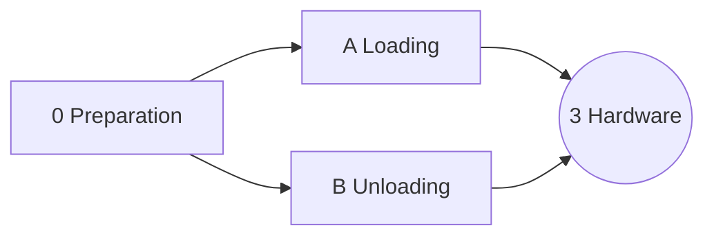

# Plan

The arm rides on a rover and works in two modes, load and unload ([D-032](decisions.md)). The work is three stages: a thin shared base first (stage 0), then loading and unloading in parallel, one agent each ([D-034](decisions.md)). Every stage is accepted on the simulator; hardware is a later stage 3, planned when A and B pass.

## Status board

Agents and humans update this table when they pick up, finish, or get blocked on a stage. Task-level progress is in each stage's brief.
Status values: `todo` · `in progress` · `blocked` · `review` · `done`.

| Stage | Status | Owner | Branch | Notes |
| --- | --- | --- | --- | --- |
| [0: Preparation](rover/0-preparation.md) | done | Softjey + Claude | `stage/0-preparation` | contracts, base scene, rig on the rover, wiring; known issues handed to A and B |
| [A: Loading](rover/a-loading.md) | in progress | Softjey + Claude | `claude/pensive-banach-a6b5d1` | A0: the rover and the scene from photos, one cargo box ([D-035](decisions.md)) |
| [B: Unloading](rover/b-unloading.md) | todo | — | — | the cargo box into the laundry bins; color sorting open ([D-035](decisions.md)) |

## How A and B stay out of each other's way

- Each owns a scene file, a loop file, a detector and a dashboard panel (lanes in [architecture.md → Repo layout](architecture.md#repo-layout)).
- Shared code (core, arm, the base scene, the layout tool, the state machine, the dashboard backend) changes only through the contract rules in [AGENTS.md](../AGENTS.md). Both stages need new named poses: land them as small separate PRs and rebase often.
- The front end's shared part (tabs, 3D view) is A6; B5 builds its panel on it.
