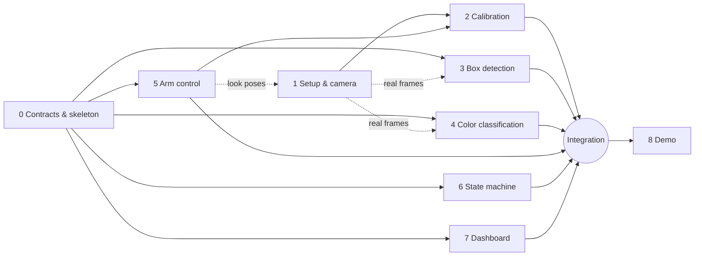

# Plan

## Status board

Agents and humans update this table when they pick up, finish, or get blocked on a block.
Status values: `todo` · `in progress` · `blocked` · `review` · `done`.

| # | Block | Status | Owner | Branch | Blocked by / notes |
| --- | --- | --- | --- | --- | --- |
| 0 | [Contracts & skeleton](tasks/00-contracts.md) | review | Softjey + Claude | `block/00-contracts` | — |
| 1 | [Setup & camera](tasks/01-setup-camera.md) | todo | — | — | — |
| 2 | [Calibration](tasks/02-calibration.md) | todo | — | — | — |
| 3 | [Box detection](tasks/03-box-detection.md) | todo | — | — | — |
| 4 | [Color classification](tasks/04-color-classification.md) | todo | — | — | — |
| 5 | [Arm control](tasks/05-arm-control.md) | todo | — | — | — |
| 6 | [State machine](tasks/06-state-machine.md) | todo | — | — | — |
| 7 | [Dashboard](tasks/07-dashboard.md) | todo | — | — | — |
| 8 | [Demo preparation](tasks/08-demo.md) | todo | — | — | — |

## Dependencies

- **Block 0 comes first and is short.** It fixes the stack, the repo layout, the interfaces, and the stubs. After it, blocks 3–7 run fully in parallel.
- **Block 1 is physical work** (zones, wrist camera mount, lamp) and runs in parallel with block 0. Its ROIs and datasets need the look poses from block 5.
- **Block 2** needs the camera mount from block 1 and FK + motion from block 5. It reuses the Seeed hand-eye script (D-006).
- **Blocks 3 and 4** start on photos or recorded frames and switch to look-pose recordings and live frames once blocks 1 and 5 are ready.
- **Block 6** is developed against the simulator. Real integration needs 2–5.
- **Block 8** starts early for one thing: choose the demo clothes on day 1, since thresholds and grasp depth are tuned on them.

## Suggested order

1. **First hours:** block 0 (contracts), block 1 (rig), and a manual grasp test: move the arm by hand-coded commands and check that it can pick real clothes from the box. Grasping is the main project risk. Validate it before investing in vision.
2. **Parallel:** blocks 3, 4, 5, 6, 7 on stubs and recordings. Block 2 once the rig and arm are ready.
3. **Integration:** swap stubs for real modules, end-to-end runs, tuning.
4. **Demo:** rehearsals, backup video.
