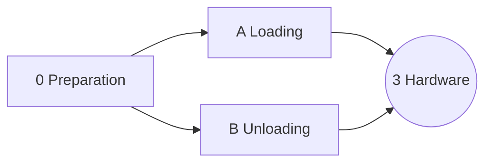
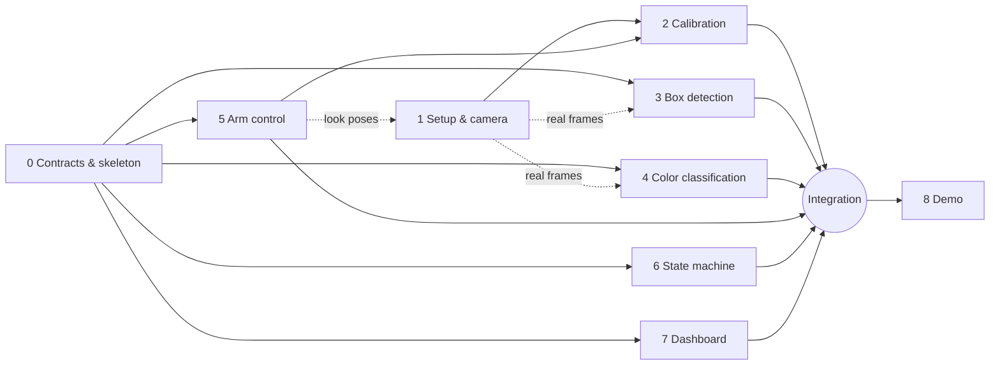

# Plan

## Current: rover stages

The arm now rides on a rover and works in two modes, load and unload ([D-032](decisions.md)). The work is three stages: preparation first, then loading and unloading in parallel. Every stage is accepted on the simulator; hardware is a later stage 3, planned when A and B pass.

| Stage | Status | Owner | Branch | Notes |
| --- | --- | --- | --- | --- |
| [0: Preparation](rover/0-preparation.md) | todo | — | — | contracts, rover sim scene, reach layout, benchmark |
| [A: Loading](rover/a-loading.md) | todo | — | — | needs 0 |
| [B: Unloading](rover/b-unloading.md) | todo | — | — | needs 0 |

Task-level progress is tracked in each stage file.

## Table setup (blocks 0–8, superseded by the rover stages)

The blocks below built the table sorter. Their code is the base the rover stages reuse (arm, calibration, camera, box detector, color logic, dashboard); stage 0 decides what stays.

### Status board

Agents and humans update this table when they pick up, finish, or get blocked on a block.
Status values: `todo` · `in progress` · `blocked` · `review` · `done`.

| # | Block | Status | Owner | Branch | Blocked by / notes |
| --- | --- | --- | --- | --- | --- |
| 0 | [Contracts & skeleton](tasks/00-contracts.md) | done | Softjey + Claude | `block/00-contracts` | — |
| 1 | [Setup & camera](tasks/01-setup-camera.md) | in progress | Softjey + Claude | `feat/sim-3d-arm` | RealSense driver written, untested on the device; physical rig, ROI and record tools left |
| 2 | [Calibration](tasks/02-calibration.md) | in progress | Softjey + Claude | `feat/sim-3d-arm` | backend + hand-eye tool done, rehearsed in the sim; touch-test tool and the rig run left |
| 3 | [Box detection](tasks/03-box-detection.md) | in progress | Softjey + Claude | `feat/sim-3d-arm` | depth detector works in the physics sim; tuning on rig frames left |
| 4 | [Color classification](tasks/04-color-classification.md) | in progress | Maciej | `block/04-color-classification` | tuning on real frames needs block 1 |
| 5 | [Arm control](tasks/05-arm-control.md) | in progress | Softjey + Claude | `feat/sim-3d-arm` | controller + physics sim done; real arm, pose teaching and tuning need the hardware |
| 6 | [State machine](tasks/06-state-machine.md) | review | Softjey + Claude | `block/06-state-machine` | — |
| 7 | [Dashboard](tasks/07-dashboard.md) | review | Softjey + Claude | `block/07-dashboard` | — |
| 8 | [Demo preparation](tasks/08-demo.md) | todo | — | — | — |

### Dependencies

- **Block 0 comes first and is short.** It fixes the stack, the repo layout, the interfaces, and the stubs. After it, blocks 3–7 run fully in parallel.
- **Block 1 is physical work** (zones, wrist camera mount, lamp) and runs in parallel with block 0. Its ROIs and datasets need the look poses from block 5.
- **Block 2** needs the camera mount from block 1 and FK + motion from block 5. It reuses the Seeed hand-eye script (D-006).
- **Blocks 3 and 4** start on photos or recorded frames and switch to look-pose recordings and live frames once blocks 1 and 5 are ready.
- **Block 6** is developed against the simulator. Real integration needs 2–5.
- **Block 8** starts early for one thing: choose the demo clothes on day 1, since thresholds and grasp depth are tuned on them.

### Suggested order

1. **First hours:** block 0 (contracts), block 1 (rig), and a manual grasp test: move the arm by hand-coded commands and check that it can pick real clothes from the box. Grasping is the main project risk. Validate it before investing in vision.
2. **Parallel:** blocks 3, 4, 5, 6, 7 on stubs and recordings. Block 2 once the rig and arm are ready.
3. **Integration:** swap stubs for real modules, end-to-end runs, tuning.
4. **Demo:** rehearsals, backup video.
