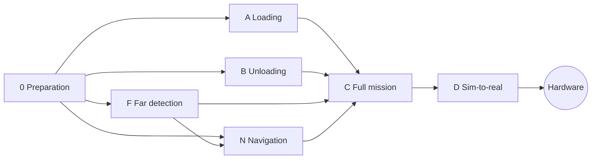

# Plan

The arm rides on a rover and sorts socks: load from the floor, unload at a station ([D-032](decisions.md)). Stage 0 built a thin shared base ([D-034](decisions.md)); then loading, unloading, far detection and navigation run in parallel, one agent each; the full mission ties them together, and a sim-to-real check comes before the hardware ([D-035](decisions.md)). Every stage is accepted on the simulator.

## Status board

Agents and humans update this table when they pick up, finish, or get blocked on a stage. Task-level progress is in each stage's brief.
Status values: `todo` · `in progress` · `blocked` · `review` · `done`.

| Stage | Status | Owner | Branch | Notes |
| --- | --- | --- | --- | --- |
| [0: Preparation](rover/0-preparation.md) | done | Softjey + Claude | `stage/0-preparation` | contracts, base scene, rig on the rover, wiring; known issues handed to A and B |
| [A: Loading](rover/a-loading.md) | todo | — | — | socks from the floor into the cargo compartments |
| [B: Unloading](rover/b-unloading.md) | todo | — | — | cargo compartments into the laundry bins |
| [F: Far detection](rover/f-far-detection.md) | todo | — | — | socks seen 0.5–3 m away from a search pose, as targets on the floor |
| [N: Navigation](rover/n-navigation.md) | todo | — | — | driving rover: to F's targets, stop within reach, dock at the station |
| [C: Full mission](rover/c-mission.md) | todo | — | — | needs A, B, F, N: rover interface, stow, mission loop, benchmark |
| [D: Sim-to-real](rover/d-sim-to-real.md) | todo | — | — | needs C: the benchmarks under rig-like errors |
| Hardware | todo | — | — | not planned in detail yet: measure the rover, calibrate, the real interface, real socks |
| [ROS 2: rover navigation](rover/ros2-navigation.md) | in progress | Slava + Claude | `block/09-rover-navigation` | outside the stages: RTAB-Map + Nav2 on the real Leo Rover (room mapped, mask made; first navigation run next); MuJoCo Leo Rover sim driven by jevomir (D-039), reusable for N1 |

## How the parallel stages stay out of each other's way

- Each owns its scene file, loop or package, and dashboard panel (lanes in [architecture.md → Repo layout](architecture.md#repo-layout); N fixes its lane when it starts).
- Shared code (core, arm, the base scene, the layout tool, the state machine, the dashboard backend) changes only through the contract rules in [AGENTS.md](../AGENTS.md). A, B and F need new named poses and N makes the rover base movable: land such changes as small separate PRs and rebase often.
- The front end's shared part (tabs, 3D view) is A6; the other panels build on it.
